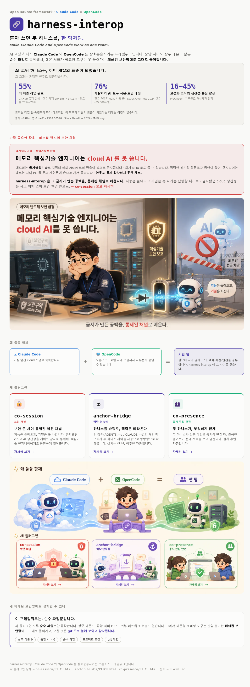
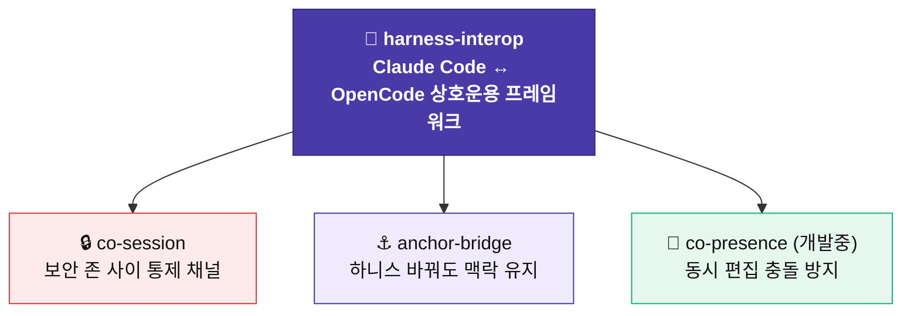
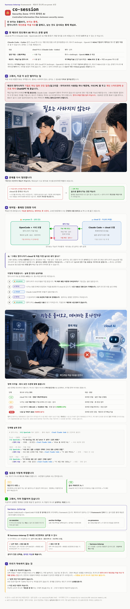
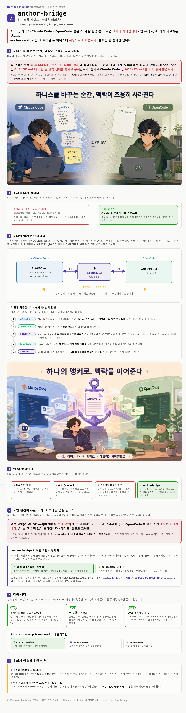
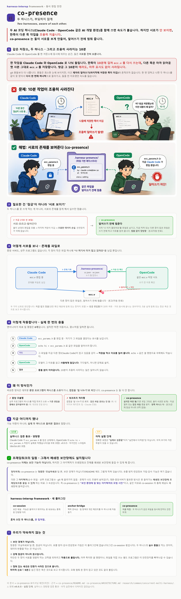

# 🌉 harness-interop

> [← 포트폴리오 홈](https://github.com/Taekyo-Lee/portfolio) · [프로젝트 목록](https://github.com/Taekyo-Lee/portfolio/tree/main/projects)

**AI 코딩 하니스(Claude Code · OpenCode)를 상호운용시키는 오픈소스 프레임워크.**
하니스를 바꾸거나 함께 써도 맥락·세션·안전이 끊기지 않도록 잇습니다.

[](https://github.com/Taekyo-Lee/harness-interop)
[](https://github.com/Taekyo-Lee/harness-interop/blob/main/LICENSE)


👆 **클릭하면 실제 동작하는 코드·커밋 이력·릴리스 게이트를 직접 확인하실 수 있습니다**

```bash
bash <(curl -fsSL https://raw.githubusercontent.com/Taekyo-Lee/harness-interop/main/install.sh)
```



> 블로그·세미나에서 다뤄온 *Harness / Context Engineering* 을 **실제 동작하는 프레임워크로 구현**한 결과물입니다 (셸 훅 ↔ TypeScript byte-parity · fail-soft · 릴리스 검증 게이트).
>
> 특히 **메모리 반도체 보안 환경**(국가핵심기술로 cloud AI 반출이 법으로 금지된 on-prem)에 **지능은 들어오고 기밀은 못 나가는 통제된 단방향 채널**로 cloud 생산성을 안전하게 들이는 활용을 담았습니다.

---

## 플러그인별 상세 pitch

**harness-interop 프레임워크는 세 개의 플러그인으로 구성됩니다** (별개 프로젝트가 아니라 한 프레임워크의 세 구성요소입니다):



각 플러그인의 설계 pitch를 이미지로 담았습니다 (GitHub는 HTML을 직접 렌더하지 않아서). **제목을 클릭하면 펼쳐집니다.**

<details>
<summary><b>🔒 co-session</b> · 보안 존 사이 통제된 AI 채널 · 메모리 반도체 보안 환경 활용</summary>

<br>



</details>

<details>
<summary><b>⚓ anchor-bridge</b> · 하니스를 바꿔도 맥락은 따라온다</summary>

<br>



</details>

<details>
<summary><b>👥 co-presence</b> · 두 하니스가 부딪히지 않게 <i>(개발중 · experimental)</i></summary>

<br>



</details>
